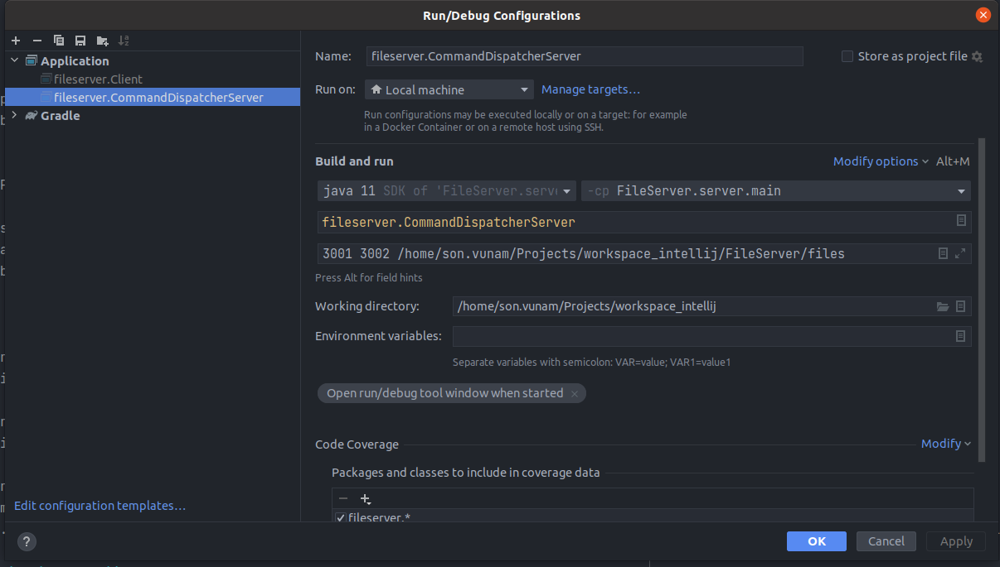
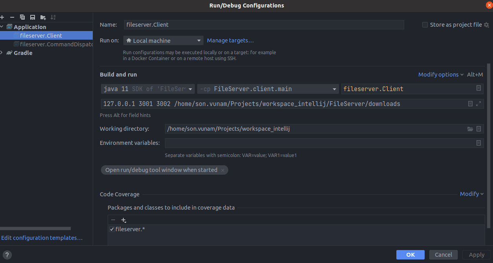

# File Server

## Before run application. You make sure your computer already install tools below:

- Gradle 7.4.2 or later. Use this command to check gradle version: gradle -v
- JDK 11.0.13 or later. 
- Port 3001 and 3002 of computer must be available. You can customize in FileServer/server/build.gradle and FileServer/client/build.gradle

## Project are configured as follows:

Server:
- 3001 is for command.
- 3002 is for data.
- '/home/son.vunam/Projects/workspace_intellij/FileServer/files' => server will list out all files in this folder.
- All values of server above can be configured by yourself. You just open file FileServer/server/build.gradle and change the value that you want to use

Client:
- 127.0.0.1 Ip Address of Server File.
- 3001 is for command. This value must have same a value with server side
- 3002 is for data. This value must have same a value with server side
- /home/son.vunam/Projects/workspace_intellij/FileServer/downloads => client will store downloaded file in this folder
- All values of client above can be configured by yourself. You just open file FileServer/client/build.gradle and change the value that you want.

## After you configure all values in 2 files FileServer/server/build.gradle and FileServer/client/build.gradle. Project can be executed in terminal as follows:

- Open a new terminal and go to project folder as FileServer
- gradle :server:clean :server:build -x test
- gradle :server:run
- Open a new terminal and go to project folder as FileServer
- gradle :client:clean :client:build -x test
- gradle :client:run
- type: index => view all files from server (It will list out all files in folder FileServer/files)
- type: hyperion360 => Unknown command
- type: get foxit.tar.gz, son.tar.gz => It will download 2 files and save into folder FileServer/downloads. You can download multiple files.  Use commas to separate file and file groups in a simple series of two or more items such as get file_name, file_name ...

## A other option, if you want to run the application in Intellij
- Step 1: Import project such as Gradle.
- Step 2: Execute fileserver.CommandDispatcherServer as per image below (pay attention for program arguments => 3001 3002 /home/son.vunam/Projects/workspace_intellij/FileServer/files):

- Step 3: Execute fileserver.Client as per image below (pay attention for program arguments => 127.0.0.1 3001 3002 /home/son.vunam/Projects/workspace_intellij/FileServer/downloads):

- type: index => view all files from server (It will list out all files in folder FileServer/files)
- type: hyperion360 => Unknown command
- type: get foxit.tar.gz, son.tar.gz => It will download 2 files and save into folder FileServer/downloads. You can download multiple files.  Use commas to separate file and file groups in a simple series of two or more items such as get file_name, file_name ...